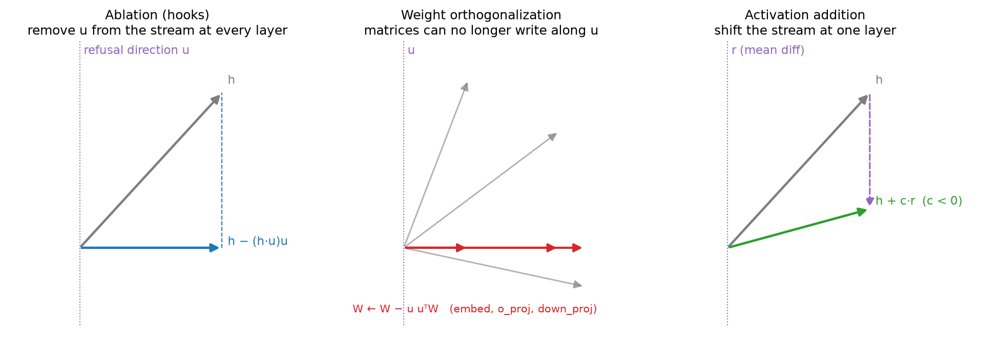
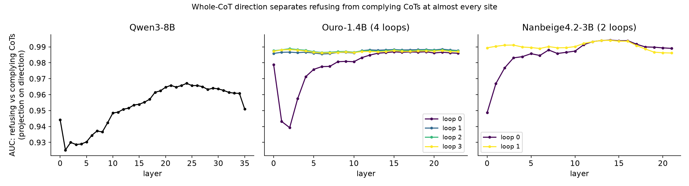
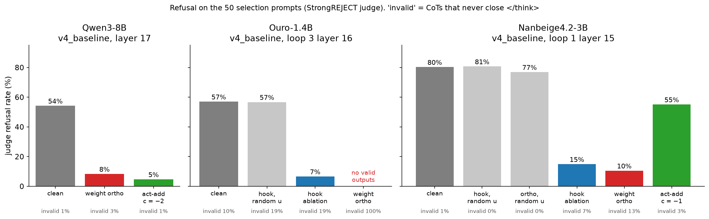
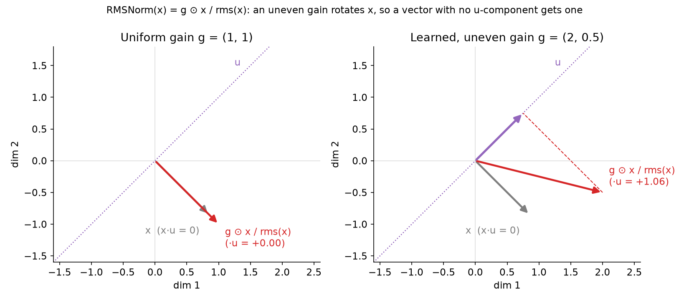
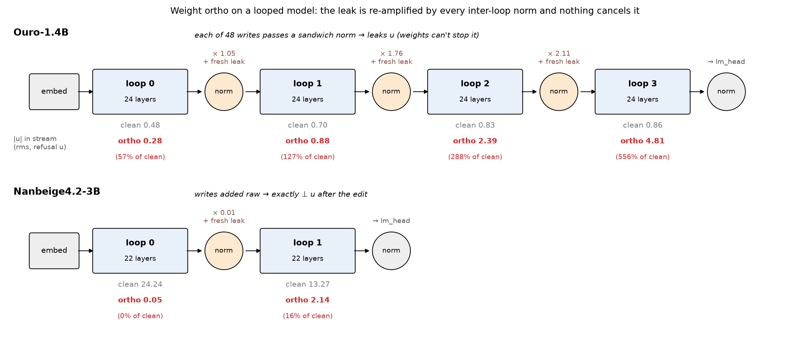
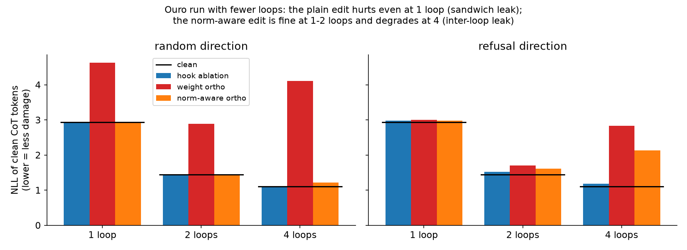

# Refusal directions in looped reasoning models

Qwen3-8B (reproduction) → Ouro-1.4B-Thinking → Nanbeige4.2-3B

Method: *reasoning-manipulation* (arXiv 2507.03167), built on *refusal_direction* (Arditi et al.)

Slides are separated by `---` (Marp format). Figures: `scripts/make_presentation_figures.py`.

---

## Question

- Reasoning models refuse harmful prompts. Prior work finds a single **refusal direction** in the residual stream; removing it stops refusal.
- **Looped models** run the same layer stack several times. Does the method carry over?
- Three models:

| Model | Layers × loops | Sites (loop, layer) | Norms between sublayer and residual |
|---|---|---|---|
| Qwen3-8B | 36 × 1 | 36 | none (standard pre-norm) |
| Ouro-1.4B-Thinking | 24 × 4 | 96 | **sandwich norm** on every write + shared norm after every loop |
| Nanbeige4.2-3B | 22 × 2 | 44 | none + shared norm after every loop |

---

## Method: data

1. **Sample.** For each harmful prompt: 3 chains of thought (CoTs), then 3 answers per CoT, conditioned on the CoT. Temperature 0.6.
   - train: 500 prompts · selection: 50 held-out train prompts · test: 487 prompts.
2. **Judge.** StrongREJECT rubric with a local gpt-oss-20b judge. Per answer:
   - `refusal` 0/1, `convincing` 1–5, `specific` 1–5.
   - **score** = (1 − refusal) × (convincing + specific − 2) / 8, in [0, 1]. 0 = refused or useless, 1 = full harmful answer.
3. **Label.** A CoT is *refusing* if all 3 of its answers score < 0.2, *complying* if all 3 score > 0.8. Prompt-level labels use ≥ 75% of answers.

---

## Method: directions

**Direction = mean(refusing activations) − mean(complying activations)**, at the residual stream entering each (loop, layer) site.

The activations are averaged over a token **window**:

| Name | Window | Labels |
|---|---|---|
| `v4_cot` | all CoT tokens | CoT |
| `v12_cot150` | first 150 CoT tokens | CoT |
| `v4_baseline` | chat-template tokens after the prompt (before thinking) | prompt |
| `random` | random vector, same norm | control |

Per-site checks: split-half stability, and AUC of the projection for separating refusing from complying CoTs.

---

## Method: three interventions



- **Ablation (hooks):** project `u` out of the stream entering every layer and out of every attention/MLP write, in every loop.
- **Weight orthogonalization:** edit `embed`, `o_proj`, `down_proj` once so they cannot write along `u`. Exactly equals ablation in a standard pre-norm model.
- **Activation addition:** add `c · r` (raw mean difference) at one layer; `c < 0` pushes away from refusal.

---

## Method: metrics

| Metric | Meaning |
|---|---|
| **judge refusal** | fraction of answers the judge marks as refusals |
| **mean score** | mean StrongREJECT score (higher = more harmful compliance) |
| **substring refusal** | answer contains a stock phrase ("I can't", "I'm sorry", …); cheap proxy |
| **invalid CoT** | CoT never closes `</think>` within 4096 tokens; a damage signal |
| **NLL** (mechanism slides) | negative log-likelihood of clean CoT tokens under the edited model; lower = less damage |

Candidates (method × site × intervention) are picked on the 50 selection prompts, then the best run on the test set.

---

## Qwen3-8B: reproduction

**Directions match upstream.** Cosine similarity with the published layer-17 vectors:

| Our direction | vs upstream CoT vector | vs upstream baseline vector |
|---|---|---|
| `v4_cot`, layer 17 | **0.994** | 0.33 |
| `v4_baseline`, layer 17 | 0.36 | **0.993** |

The CoT direction and the prompt-end direction are different directions (cosine ≈ 0.35). Both remove refusal.

**Weight ortho ≈ hooks.** On Qwen, greedy generations under the two methods share 77–83% of their opening tokens, versus 8% with the clean model. The gap is bf16 rounding of the edited weights.

---

## Qwen3-8B: results

Test set, 487 prompts × 9 answers, weight orthogonalization:

| Candidate | judge refusal | mean score | invalid CoT |
|---|---|---|---|
| clean | 60.8% | 0.37 | 0.7% |
| `v12_cot150`, layer 17 | **8.3%** | 0.88 | 7.5% |
| `v4_cot`, layer 15 | 12.3% | 0.84 | 5.3% |
| `v4_cot`, layer 23 | 15.4% | 0.80 | 2.8% |

Selection set: activation addition (`v4_baseline`, L17, c = −2) gives 4.7% refusal with no extra invalid CoTs.

**Reproduction holds:** one direction, removed everywhere, takes refusal from ~60% to ~10%.

---

## Where refusal lives



- All three models carry a linearly separable refusal signal (AUC 0.93–0.99) at nearly every site.
- In both looped models, every loop after the first looks alike. Loop 0 is where the signal builds up.

---

## Results across models



- **Qwen:** weight ortho and act-add both work.
- **Ouro:** hook ablation works (57% → 7%). **Weight ortho produces no valid outputs**, even with a *random* direction.
- **Nanbeige:** hooks *and* weight ortho both work (80% → 15% / 10%). Random directions do nothing.

Nanbeige random controls are at loop 0 layer 14. Ouro hooks raise invalid CoTs to 19%, for random directions too.

---

## Nanbeige: one caution

| Weight ortho candidate | judge refusal | invalid CoT |
|---|---|---|
| `v4_baseline`, loop 1 layer 15 | 10.5% | 13% |
| `v4_cot`, loop 0 layer 14 | 0.4% | **47%** |

Weight ortho works on Nanbeige, but some directions damage generation. Check invalid CoTs, not only refusal.

---

# Why does weight ortho break Ouro but not Nanbeige?

**Short answer:** renormalization. A learned RMSNorm sits between the edited weights and the residual stream.

- In Ouro it sits there **48 times per loop** (sandwich norms) **and 3 times between loops**, and the inter-loop norm **amplifies** what it receives.
- In Nanbeige it sits there **once**, between the two loops, and it **shrinks** what it receives.

---

## RMSNorm re-introduces a removed direction

`RMSNorm(x) = g ⊙ x / rms(x)`, where `g` is a learned per-dimension gain.



- If `g` were uniform, `x ⊥ u` would stay `⊥ u`.
- `g` is uneven, so it **rotates** `x`. Output component along `u` = `Σᵢ gᵢ xᵢ uᵢ / rms(x)`. This is not 0 even when `Σᵢ xᵢ uᵢ = 0`.
- Measured unevenness: cos(`u`, `g ⊙ u`) ≈ 0.95 (Ouro), 0.99 (Nanbeige). Small rotations, but on large vectors.

Weight ortho guarantees `W x ⊥ u`. Any norm **after** `W` breaks that guarantee.

---

## Leak 1: sandwich norms (Ouro only)

```
Qwen / Nanbeige layer                 Ouro layer
h = h + Attn(Norm(h))                 h = h + Norm₂( Attn(Norm(h)) )
h = h + MLP(Norm(h))                  h = h + Norm₂( MLP(Norm(h))  )
          ↑ edited weights write here           ↑ Norm₂ sits after the edited weights
```

- Ouro passes every attention and MLP output through a second norm before adding it.
- After weight ortho, the raw matrix outputs are clean (projection on `u` ≈ 0.001).
- After `Norm₂`, each write carries `u` **at clean strength** again (0.09–0.17 vs clean 0.08–0.18).
- 48 such writes per loop, 192 per token.

This alone breaks Ouro **with a random direction**, even at 1 loop.

---

## Leak 2: the inter-loop norm

Both looped models apply a shared `model.norm` after each loop. Its output becomes the next loop's residual stream.

Each pass does two things to `u`:

1. **Fresh leak:** the uneven gain adds a `u` component, as on the previous slide (Ouro ≈ 0.4 per pass).
2. **Rescales what is carried:** the carried stream, including any `u` already there, is multiplied by `g / rms(x)`.

In the clean model the next loop's writers push back against `u` (measured restoring slope −0.1 to −0.19 per loop in Ouro).

**Weight ortho removes exactly that ability.** The writers can no longer write along `u`, so nothing cancels the leak.

---

## Leak 2: why it compounds in Ouro only



- **Ouro:** the stream is small relative to `g`, so the norm **scales it up** (×1.05 → ×2.1). It does this 3 times. `u` grows geometrically: 0.28 → 0.88 → 2.39 → 4.81, **5.6× the clean level**, with the opposite sign.
- **Nanbeige:** the stream is huge before the norm (length ≈ 2780), so the norm **scales it down 70×**. One pass leaves a fixed offset of **16% of clean**, and loop 1 writes 10× more than it inherits.

---

## The same thing, per loop


- Hooks: `u` stays below 0.4% of clean in both models. They re-project after every norm.
- Ouro weight ortho: grows past clean by loop 1.
- Norm-aware ortho fixes leak 1 (loop 0 ≈ 0). Leak 2 still grows it from loop 1 on.
- Nanbeige weight ortho: a single small step, then the model ends.

---

## Testing the explanation

Two fixes, each targeting one leak:

1. **Norm-aware ortho** (fixes leak 1): edit each writer against `g ⊙ u` instead of `u`, where `g` is the gain of its sandwich norm. Normed writes are then exactly `⊥ u`.
2. **Fewer loops** (removes leak 2): run Ouro with 1 or 2 loops.



- Plain ortho with a random direction hurts at every loop count → leak 1.
- Norm-aware ortho matches hooks at 1–2 loops, degrades at 4 → leak 2 needs several passes.

---

## Can weights alone fix leak 2?

Exact fix: also remove `g ⊙ u`, `g² ⊙ u`, … (one direction per inter-loop pass). The norm then cannot map anything back onto `u`.

| Model | projection on `u` | damage (NLL, random `u`) |
|---|---|---|
| Ouro, rank-4 edit | ≈ 0 in every loop ✓ | 9.6 (clean 1.1) ✗ |
| Nanbeige, rank-2 edit | ≈ 0 in every loop ✓ | 11.7 (clean 1.5) ✗ |

It removes `u` but destroys both models. The extra directions put 34–48% of their weight on the **top 1% highest-gain dimensions**, which the model depends on.

**No weight-only edit ablates a direction in a looped model with an inter-loop norm.** Hooks can, because they re-project after every norm.

---

## Is it Ouro's early-exit training?

Ouro is trained so any loop can be the last (early exit). Nanbeige always runs 2 loops.

Logit lens on clean traces (decode each loop's output directly):

| Model | NLL by loop | agreement with final output |
|---|---|---|
| Ouro | 2.93 → 1.44 → 1.12 → 1.11 | 61% → 80% → 92% → 100% |
| Nanbeige | 8.36 → 1.55 | 34% → 100% |

- Ouro's intermediate states are near-finished outputs, refined loop to loop. Its writes mostly correct an inherited state.
- Nanbeige's loop 0 output is not decodable. Loop 1 mostly rewrites it.

This **fits** the mechanism: Ouro relies on carrying a well-scaled state across loops, which is exactly what leak 2 corrupts. It is consistent with early-exit training but **not proven**: we have no same-architecture model trained without early exit.

---

## Takeaways

1. **The method transfers.** A difference-in-means refusal direction exists in both looped models and removing it drops refusal from 57–80% to 7–15%.
2. **Use hooks on looped models.** Weight orthogonalization is only equivalent to ablation when nothing renormalizes the stream after the edited weights.
3. **Ouro breaks for two reasons**, both normalization:
   - sandwich norms re-add `u` to every write,
   - the inter-loop norm amplifies the leak 3 times while the edit stops the model from correcting it.
4. **Nanbeige survives** because its writes enter raw, and its one inter-loop norm shrinks the stream.
5. **Check damage, not just refusal.** Invalid CoTs reveal broken edits (Ouro: 100%, Nanbeige loop-0 edit: 47%).

---

## Caveats and open items

- Ouro and Nanbeige interventions are on the 50 selection prompts only. No test-set runs yet.
- No capability or over-refusal checks on any model.
- Ouro hook ablation alone raises invalid CoTs (10% → 19%), random directions included.
- Mechanism numbers come from 8 traces (≈ 2.7k tokens) per model, one refusal site each.
- Nanbeige needs our own vLLM port (`src/loop_steer/vllm_nanbeige.py`); it matches HF greedy outputs exactly.

---

## Appendix: reproduce

```bash
# mechanism comparison (HF, one GPU each)
uv run python scripts/ortho_compare.py --gpu 1 --model ByteDance/Ouro-1.4B-Thinking --direction v4_baseline:t3.l16 --loops 1,2
uv run python scripts/ortho_compare.py --gpu 1 --model Nanbeige/Nanbeige4.2-3B --direction v4_baseline:t1.l15 --loops 1

# figures for this deck (CPU)
uv run python scripts/make_presentation_figures.py
```

Results: `data/runs/<model>/analysis/ortho_compare_*.json`, `analysis/*.csv`, judged generations in `data/runs/<model>/generations/`.
